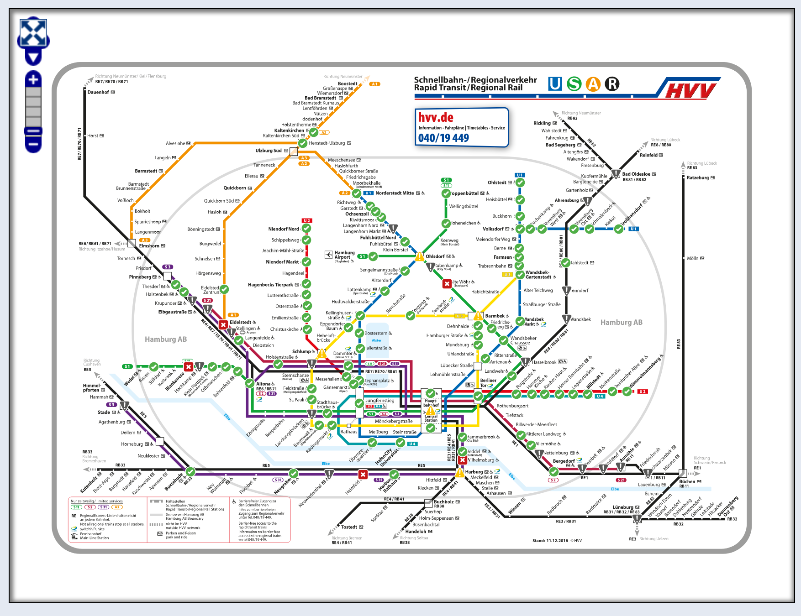

# ElevatorstatePublicTransportHamburg
API for monitoring state of elevators in Hamburg
## Data sources

What we need: 

actual state informations for sending push notifications to device and we need real coordinates of elevators. Unfortunatally there is no public API.
What we have:

Coordinates from ODSM and actual data from geofox. But thee is no reference.

### Live request from geofox

On this page Geofox supports a json with states: 
http://geofox.hvv.de/jsf/showElevatorStates.seam. Unfortunatelly the lat/lon position are fictional and only for this special map. An example response can find [here](https://github.com/AppWerft/mobileHackathon2017/blob/master/listofelevatorstates.json)

```
{
		"gfxId": "Master:11950",
		"lon": -92.1464,
		"lat": -208.9392,
		"elevators": {
			"A": {
				"state": 1,
				"description": "Zugang Alsterpavillion <-> Schalterhalle",
				"label": "A",
				"type": "DURCHLADER",
				"tasterType": "KOMBI",
				"lines": [],
				"cabinLength": 0,
				"cabinWidth": 0,
				"doorWidth": 0,
				"instCause": ""
			},
			"B": {
				"state": 1,
				"description": "Schalterhalle <-> Zwischenebene (U2,U4)",
				"label": "B",
				"type": "DURCHLADER",
				"tasterType": "KOMBI",
				"lines": [],
				"cabinLength": 0,
				"cabinWidth": 0,
				"doorWidth": 0,
				"instCause": ""
			}
		},
		"mainSubStation": {
			"linkId": "Master_11950",
			"stationName": "Jungfernstieg S1/S2/S3/U1",
			"comment": "Haltestelle nicht barrierefrei"
		},
		"additionalSubStations": {
			"Master_11950_U": {
				"linkId": "Master_11950_U",
				"stationName": "Jungfernstieg U2",
				"lineKeys": ["HHA-U:U2_HHA-U_HHA-R"],
				"comment": "Einstieg für Rollstuhlfahrer im gekennzeichneten Bereich"
			}
		}
	}
```
This data renders this map:

### Overpass 

[Overpass](http://overpass-turbo.eu/) is a protocol to request data from OSM.

With it we can ask the database of OSM with this request:

```
[out:json];
area[name="Hamburg"];
(
  node["highway"="elevator"](area);
  way["highway"="elevator"](area);
  relation["highway"="elevator"](area);
);
out body;
>;
out skel qt;
(._;>;);out;
```
and get i.e.

```
{
  "type": "node",
  "id": 430136424,
  "lat": 53.5531786,
  "lon": 9.9936662,
  "tags": {
    "description": "Straße/Schalterhalle",
    "entrance": "yes",
    "entrance_marker:s-train": "yes",
    "entrance_marker:subway": "yes",
    "entrance_name": "Jungfernstieg",
    "highway": "elevator",
    "manufacturer": "Lutz- Aufzüge",
    "name": "Jungfernstieg",
    "operator": "HOCHBAHN",
    "railway": "subway_entrance",
    "ref": "10909",
    "since": "2006",
    "toilets:wheelchair": "yes",
    "tunnelsystem_jungfernstieg": "eingang",
    "wheelchair": "yes",
    "wheelchair:description": "Aufzug vom Jungfernstieg nach unten: Rolli-WC ohne Euroschlüssel- aber Toilettenpersonal bis 22:30"
  }
},
```
This data renders this map:


# Server for sending notifications
The nodeJS realized server has three tasks

## Subscribe/unsubscribe devices
For this run a http-server with endpoints 

* /subscribe?token=TOKEN and 
* /unsubscribe?token=TOKEN. 

Both methods persist the tokens in a local sqlite database

## Fetch data from geofox and detecting changes
A simple periodically request retreives the JSON, extracts the states, saves in an array and in next step compares with lastest ones. Is there a diff then the push sender will started

## Sending notification to devices

The method get all deviceTokens from local database and sends all notifications.

# Android  App

The app subscribes to server app and receives notifications. In main view is a google map to show current states. In a second tab  is a list of elevators, sorted by distance to it.